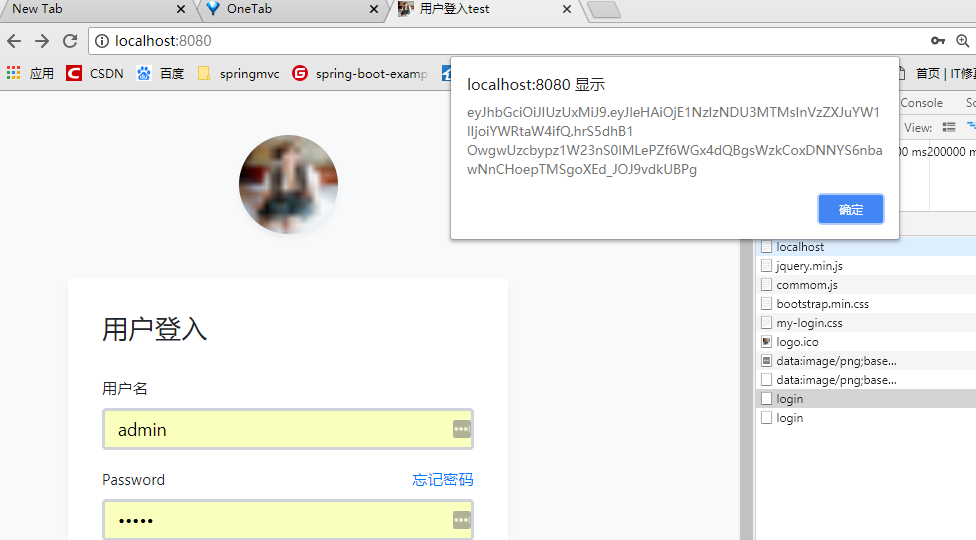

# springboot

   

## 快速部署

>修改source下的applicat..yml中有关数据源的配置即可运行

## 项目优点

* 有前端和后端代码，可以完美的实现jwt运行过程
* 注释多

## 测试

+ 输入localhost:8080,登入成功后会打印出生成的token，如图:

+ 输入localhost:8080/to 看一下受保护的接口是否能够进行访问，如图：。

  

## 技术栈

springboot+mybatis+themyleaf+jwt

